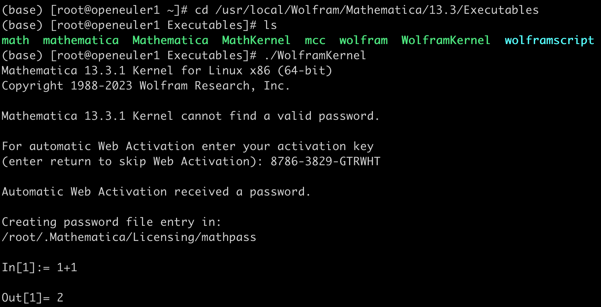
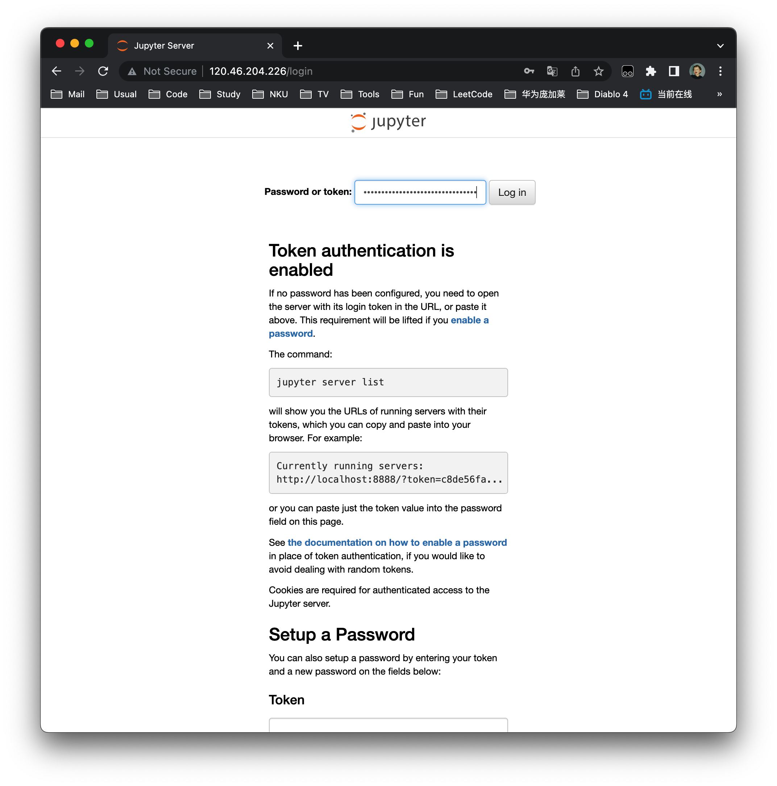

## 实训大作业：C/S部署Mathematica内核

**小组成员：2120230824 张嘉诚**

[toc]

### 部署Mathmatica

##### 使用教育邮箱获取激活码

- 使用在 https://account.wolfram.com/login/create 使用教育邮箱注册Wolfram账号
- 在 https://www.wolfram.com/siteinfo/ 如实填写信息获取激活码


##### 安装Mathematica

- 在 https://wolfram.com/download-center/mathematica/ 下载Linux版Wolfram Mathematica

- 上传安装文件至服务器

  

- `bash Mathematica_13.3.1_LINUX.sh` 安装

  

- 激活与使用

  ```sh
  cd /usr/local/Wolfram/Mathematica/13.3/Executables
  ./WolframKernel # 输入激活码之后就能正常使用了
  ```

  

  

- 其实Mathmatica有可供Web访问的软件

  https://support.wolfram.com/17399 该文档描述了如何部署Web Mathmatica

  但我们的教育邮箱无法获取该应用

  

  所以转变思路，在服务器部署Jupyter Notebook，通过它连接Mathmatica Kernel，同样能够实现**指令提交与结果呈现**的任务

### 部署Jupyter Notebook

##### 安装Jupyter

```sh
pip install jupyter
```

##### 部署Jupyter Notebook

```
screen -S jupyter jupyter notebook --ip=0.0.0.0 --port=80 --no-browser --allow-root
```

> 使用Screen后台运行Jupyter
>
> `--ip=0.0.0.0` 参数将Jupyter Notebook绑定到服务器的所有可用网络接口，这意味着可以从任何网络接口访问Jupyter Notebook，包括通过服务器的公共IP地址和内部网络接口（例如`localhost`或`127.0.0.1`）。
>
> `--no-browser` 禁用自动打开浏览器选项使Jupyter Notebook在服务器上以无头（headless）模式运行，只允许远程用户通过浏览器访问它，而不会在服务器上创建图形界面。

获取Token


访问服务器ip地址并登录



### 为Jupyter添加Mathmatica内核

使用Wolfram官方推出的配置工具

```
git clone https://github.com/WolframResearch/WolframLanguageForJupyter.git
cd WolframLanguageForJupyter/
./configure-jupyter.wls add
```

查看Jupyter已配置的内核

```
jupyter kernelspec list
```

显示wolframlanguage即成功配置


重启Jupyter Notebook后新建Notebook选择内核为Wolfram Language


### 测试Mathmatica能否完成指令提交与结果呈现


至此，任务完成，该服务器的Jupyter应用将会持续运行一段时间，上文的Test_Mathmatica脚本也能正常运行，您可以访问 http://120.46.204.226/tree?token=3fa63a7b113af4c2b639bc7aa7b85c8fe2bb7738c1c9a875.

